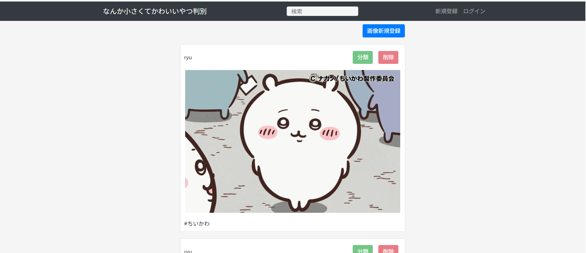

# プロジェクト名

なんか小さくてかわいいやつ判別

## 概要

このアプリケーションは、教科書の flask 機械学習を参考にモデルを作り**[#ちいかわ#その他を判断するシステム]** です。

## 主な機能

- 画像の閲覧
- 画像の判別(#ちいかわ or #その他)
- 画像の投稿(ログイン時のみ)
- 画像の削除
- ログイン機能

- アカウントの作成
- タグの検索

## 画面イメージ

## 起動

flask run
